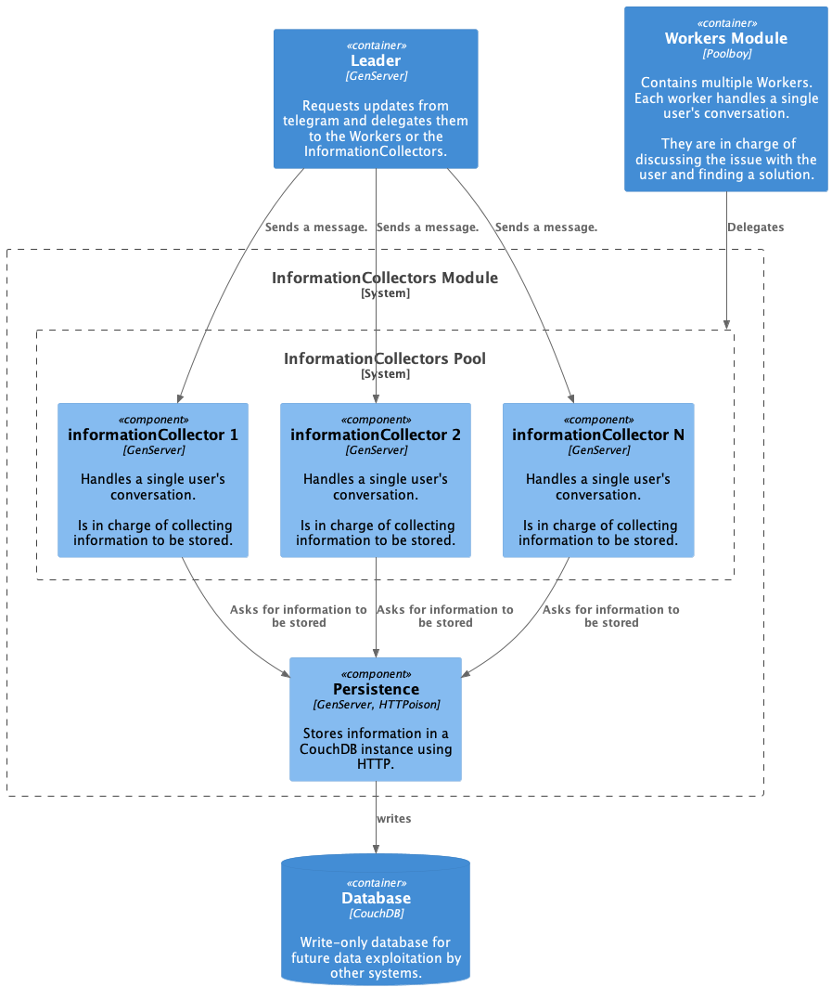

# Chatbot

A chatbot that will allow users to gather information or get help when facing a potentially harmful situation.

## Run The Program

To run the program it has to be given the token of the bot to be used:

**COMMAND**: `TELEGRAM_BOT_SECRET= {BOT_TOKEN} mix run --no-halt`

## Requirements

- [CouchDB](https://couchdb.apache.org/) must be installed and running in port `5984`. There must exist a user with the following credentials (<ins>only for development</ins>):

    - Login &rarr; "admin"
    - Password &rarr; "admin"
  
  When deploying the bot this credentials must be customized in `persistence.ex`.

## Architecture

### Context Diagram:

### Container Diagram:

### Component Diagram:

#### Workers Module

#### InformationCollectors Module

### Delegate Behaviour Sequence Diagram

